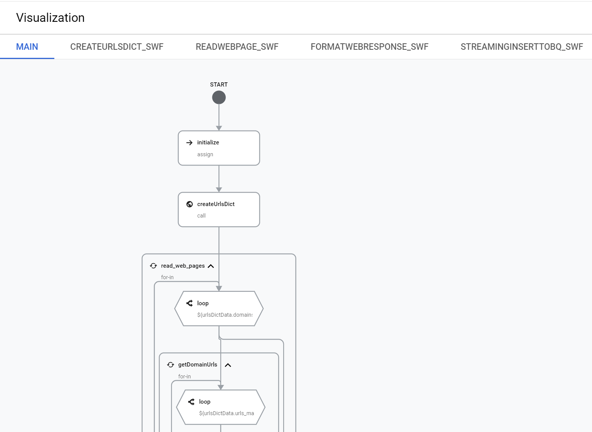
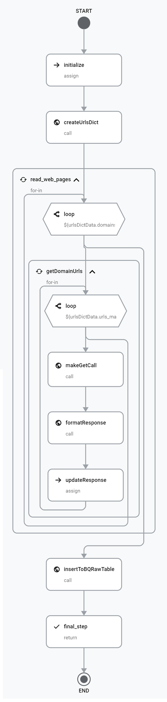
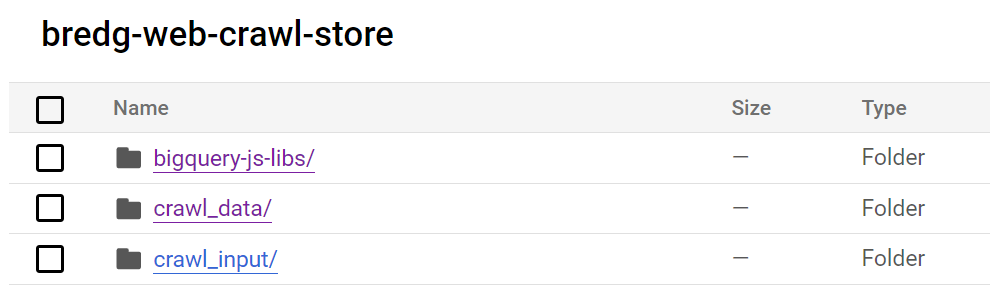
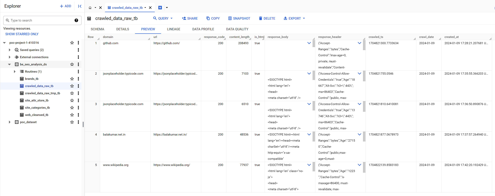

# WEB Crawler and Store using GCP

Used only Workflow (without CFN) to crawl and store RAW data in to BigQuery for POC purpose.

**Note:** 
- This may not work for all the urls, as there is a limit of 2MB response size in HTTP GET


## Services used
- Google Workflow (for orchestration)
- Google Storage
- Google Cloud function (for crawl and format) (not used here)
- Google BigQuery


## ETL flow

Though I have used only WF here for crawling and storing, I would use below architecture for scaling more inputs and crawl responses.


### Current Flow






## Storage structure

### RAW response store



### Database store (sample)




## HTML Parsing approach

I have used cheerio (jaavscript library) along with BigQuery Function to parse the HTML.
But, its better to use Python (BeautifulSoup..) in Cloud function to have more control and debugging (logging).

I have packaged **cheerio** and uploaded in to GCS (gs://bredg-web-crawl-store/bigquery-js-libs/cheerio.js).

#### Example:

```sql
CREATE OR REPLACE FUNCTION `poc-project-1-410316.be_seo_analysis_ds.parse_html_fn`(html_str STRING)
RETURNS STRING
LANGUAGE js
OPTIONS (library = 'gs://bredg-web-crawl-store/bigquery-js-libs/cheerio.js')
AS r"""

let test_html = "\n\n\n\n\n\n<!DOCTYPE html>\n<html\n  lang=\"en\"\n  \n  \n  data-a11y-animated-images=\"system\" data-a11y-link-underlines=\"true\"\n  >\n\n\n\n\n  <head>\n<meta charset=\"utf-8\"><title>GitHub: Let’s build from here · GitHub</title><meta name=\"description\" content=\"GitHub is where over 100 million developers shape the future of software, together.\"></head>\n\n  <body><div id=\"js-global-screen-reader-notice-assertive\" class=\"sr-only\" aria-live=\"assertive\" aria-atomic=\"true\">test content</div>\n  </body>\n</html>"

let meta_info = {}
const html_obj = cheerio.load(html_str);

let title = html_obj('title').text();
let meta_desc = $('meta[name="description"]').attr('content');
let meta_viewport = $('meta[name="viewport"]').attr('content');
let canonical_url = $('link[rel="canonical"]').attr('href');

// Parse other tags and content and collect required attributes

return meta_info
""";
```

